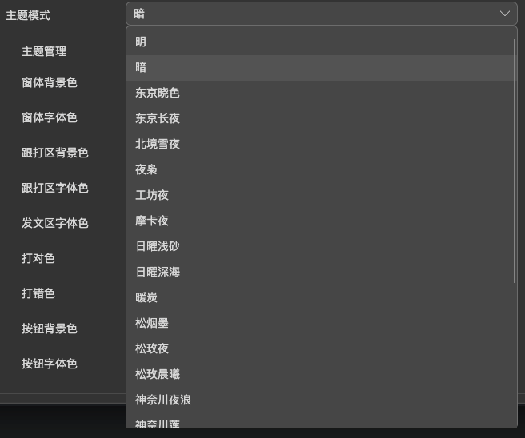
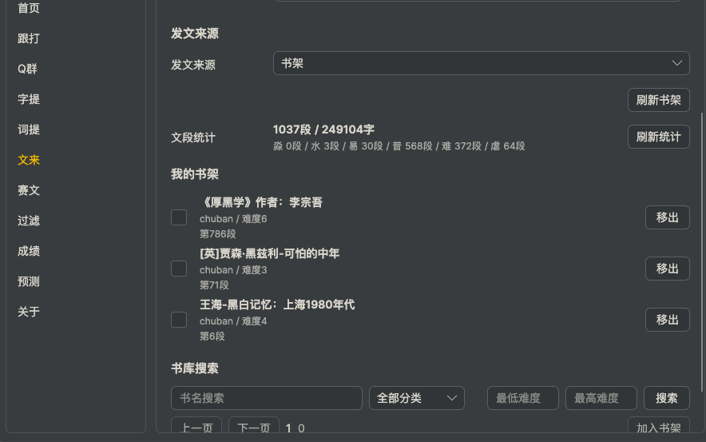

# 晴跟打Pro 使用手册

**[晴跟打Pro]**-比晴跟打更好用的全平台跟打器，支持mac，win，web网页，**自带超高性能发文和赛文，全功能免费**

UI大重构！支持mac液态玻璃，win云母亚克力

内置双拼练习工具，基于[开源双拼练习工具](https://github.com/BlueSky-07/Shuang)深度优化！加入智能推送算法，双拼练习更高效！

可连Q群发文载文，错字慢字重打，趣味贪吃蛇模式，对照模式，字帖模式，临摹模式，超好用~

**[晴发文]**-一套性能强大的发文+赛文系统，文库中包含1万多本书籍，1亿+段每段200字左右的文段，支持完全随机，上下翻页，选中书籍定向发文等功能

[晴发文](https://github.com/a810439322/preachSunny) 尚未开源，但仍全功能开放并免费使用，也欢迎其他发文工具接入发文系统，唯一要求：发文末尾署名-晴发文

[晴跟打Pro]基于[晴跟打](https://github.com/fcxxxz/TypeSunny)深度优化和重构，在此致敬我自己，真是辛苦我了

## 目录

1. [软件简介](#软件简介)
2. [快速开始](#快速开始)
3. [常用快捷键](#常用快捷键)
7. [赛文](#赛文)
8. [练单器](#练单器)
9. [常见问题](#常见问题)

---

## QQ支持说明

支持的QQ版本为9.9.22.40990(不包含)之后的版本，目前2026.05.08版本为 9.9.29-47354，之后版本将长期支持~
# 字帖模式 体验超棒！

# 一键极简！启动！~

# 超多主题

# 通透模式！

# 通透+一键极简！

# 书架！

---

## 快速开始

### 下载说明

| 文件 | 适合用户 | 说明 |
| --- | --- | --- |
| `TypeSunnyPro-版本号-update.zip` | Windows 用户 | Windows 轻量包和应用内更新包，需要先安装 .NET 10 Desktop Runtime。 |
| `TypeSunnyPro-版本号-macos-arm64.dmg` | Mac 用户 | Mac 用户请下载这个。打开 DMG 后先看 `1-安装步骤-先读我.txt`：把 `晴跟打Pro.app` 拖到“应用程序”，再运行 `2-首次打不开时运行.command`；被系统拦截时到 系统设置 > 隐私与安全性 点“仍要打开”。如提示输入监控/辅助功能，需允许“晴跟打Pro按键监听”；列表里没有时点“+”添加 `~/Library/Application Support/晴跟打Pro/KeyMonitor/晴跟打Pro按键监听`，然后重启晴跟打Pro。 |
| `TypeSunnyPro-版本号-macos-arm64.zip` | 应用内更新 | 给 macOS 应用内更新使用，普通用户不要优先下载。 |
| `*-package.json` | 程序更新器 | 更新器读取的包清单，普通用户不用下载。 |

### 第一次使用

1. **运行**：双击 `晴跟打Pro.exe` 启动程序

2. **文来！**：
    - 文来按钮点击左键或Ctrl+R，可直接发文
    - 请根据提示注册登录，帐号同昵称，无注册限制，可使用中文，密码加密存储，作者也看不到，请自己保存好帐号密码(后期会加邮件重置密码和改密功能)
        - 设置页面可设置文来字数，文来难度，文来服务器地址
            - Ctrl+P下翻页，Ctrl+O(是字母O不是数字0)上翻页，看到感兴趣的文可以继续往下看~也可以设置顺序发文或随机发文
    - 文来按钮点击右键，可退出登录、切换服务器地址
        - 允许加入任何自建发文服务，默认发文接口地址：https://typing.fcxxz.com/
        - 自建方法：本地或服务器部署晴发文系统，如需自建，可直接问作者要docker镜像，如需用在外部发文，请遵守君子协定：发文末尾署名-晴发文

3. **本地书籍跟打**：
    - 将 txt 文件放入软件目录的 `文章` 文件夹
    - 点击首页文章管理或Ctrl+B，方向上下左右都有功能，回车即可发文

3. **赛文**：
    - 自定义赛文服务器
        - 允许加入任何自建赛文服务，默认赛文接口地址：https://typing.fcxxz.com/
        - 自建方法：本地或服务器部署晴发文系统，如需自建，可直接问作者要docker镜像，如需用在外部发文，请遵守君子协定：发文末尾署名-晴发文
    - 其他赛文：已接入锦标赛，极速杯，如需接入其他赛文，可联系作者接入

---

## 常用快捷键

| 快捷键      | 功能       |
|----------|----------|
| F3       | 重新打当前文章  |
| F4       | 从QQ群加载文章 |
| F5       | 选QQ群     |
| CTRL + E | 剪切板载文    |
| Ctrl + R | 文来       |
| Ctrl + P | 下一段      |
| Ctrl + O | 上一段      |
| Ctrl + L | 乱序重打     |

### 贪吃蛇模式

- 只显示当前位置前后的文字
- 前后显示字数可在设置中调整
- 在设置中开启"贪吃蛇模式"

---

## 赛文

### 参加比赛

1. 点击底部 `赛文` 菜单
2. 选择要参加的比赛类型
3. 系统自动加载比赛文章
4. 完成打字后成绩自动上传
5. 请注意，赛文过程中不可暂停

### 查看排行榜
点击 `赛文` 菜单中的排行榜
点击成绩栏右上角的奖杯图标，查看晴跟打Pro内部的字数榜

---

## 练单器

练单器用于固定文本的重复练习，适合突破特定字词或段落。
- 每练完一组，会自动弹出本组平均成绩

---

## 常见问题

### Q: 新手如何提高打字速度？
- 多练前500，中500，后500
- 目标：前500总字数控制在800字左右的同时均击达到6击，再开始打文

### Q: 支持哪些文章格式？

A: 支持 txt 文本文件和 epub 电子书格式。

### Q: 如何调整字体大小？

A: 在对应窗口直接ctrl+鼠标滚轮，或设置页面

---

## 技术支持

如有问题请进Q群 715187175 中反馈。

